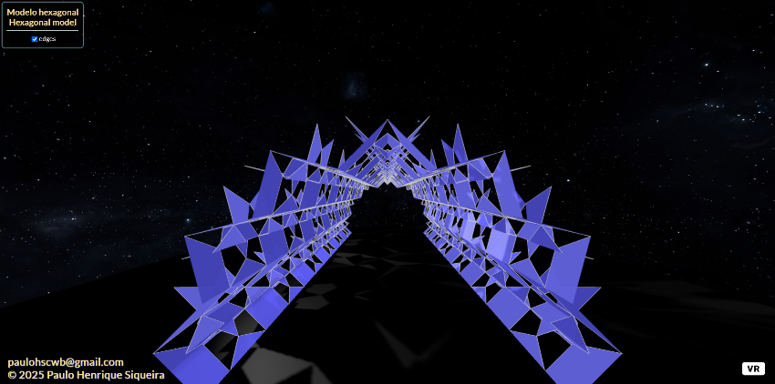

<link rel="stylesheet" href="scripts/style.css">
<meta charset="utf-8">
<link rel="icon" type="image/png" href="catalangems/vr/salas/imagens/icone.png">
<h2>Visualization with Virtual Reality (VR) in A-frame</h2>
 <b>author:</b> Paulo Henrique Siqueira - Universidade Federal do Paraná
  <b>contact:</b> <a href="#">paulohscwb@gmail.com</a>
  <a href="https://paulohscwb.github.io/kirigami/pt-br/">versão em português</a>
 

  Kirigami is a traditional Japanese art form that means "paper cutting" (kiru - to cut, kami - paper). It is a variation of origami that combines the technique of folding paper with the art of cutting it to create three-dimensional figures and interesting shadow effects.
 Origami uses only folds, while kirigami introduces cuts to add volume and complexity to the shapes. It can be used in decorations, cards, models, and other objects.
 This work show the art of kirigami in a slightly different way: the sheets are modeled in files for viewing in Virtual Reality (VR).

<h3 style="margin-top:3px"><a target="_blank" href="parte1/"> Polygonal kirigamis</a></h3>
<!--<h3 style="margin-top:3px"><a target="_blank" href="parte2/"> Floral themes</a></h3>-->

<h3 align="center">Virtual Reality</h3>

<h3 align="center">3D models</h3>

 The orbit scripts developed by <b>Kevin Ngo</b> were used in the Virtual Reality pages of the 3D models: <a href="https://github.com/supermedium/superframe/tree/master/components/orbit-controls/" target="_blank"> Orbit controls for A-Frame</a>.
 The teleport scripts developed by <b>Fernando Serrano</b> were used in the Virtual Reality pages of the 3D models: <a  href="https://aframe.io/blog/teleport-component/" target="_blank"> Developing an A-Frame Teleport Component</a>
 

  Kirigami: visualization with Virtual Reality by <a xmlns:cc="http://creativecommons.org/ns#" href="https://paulohscwb.github.io/kirigami/" property="cc:attributionName" rel="cc:attributionURL">Paulo Henrique Siqueira</a> is licensed with a license <a rel="license" href="http://creativecommons.org/licenses/by-nc-nd/4.0/">Creative Commons Attribution-NonCommercial-NoDerivatives 4.0 International</a>.

<h4>How to cite this work:</h4> 

Siqueira, P.H., "Kirigami: visualization with Virtual Reality". Available in: <https://paulohscwb.github.io/kirigami/>, August 2025.

<!---->

 <b>References:</b>
 Otsu, G. M., Yamada, T. R. U. Kirigami 3D aplicado: uma proposta em design de produto dobrável. Revista Brasileira de Expressão Gráfica, v. 7, n. 1, 2019 <a href="https://www.rbeg.net/index.php/rbeg/article/view/73" target="_blank">https://www.rbeg.net/index.php/rbeg/article/view/73</a>
 Khalilzadehtabrizi, S., Mohagheghian, I., Walker, M. G., Analysis and design of Kirigami-based metallic energy-dissipating systems, Thin-Walled Structures, v 212, 2025 <a href="https://doi.org/10.1016/j.tws.2025.113127" target="_blank">https://doi.org/10.1016/j.tws.2025.113127</a>
Yamada, T. R. U. Processo de Experimentação e criação de modelos autorais de Kirigami 3D baseados em técnicas de dobra e corte. In: Anais Graphica 2024: XV International Conference on Graphics Engineering for Arts and Design. Pelotas(RS), 2024. <a href="https://www.even3.com.br/anais/graphica-430628/826538-processo-de-experimentacao-e-criacao-de-modelos-autorais-de-kirigami-3d-baseados-em-tecnicas-de-dobra-e-corte/" target="_blank">https://www.even3.com.br/anais/graphica-430628/826538-processo-de-experimentacao-e-criacao-de-modelos-autorais-de-kirigami-3d-baseados-em-tecnicas-de-dobra-e-corte/</a>
