<link rel="stylesheet" href="../scripts/style.css">
<meta charset="utf-8">
<link rel="icon" type="image/png" href="vr/salas/imagens/icone.png">
<h2>Visualization of Kirigamis with Virtual Reality (VR) in A-frame</h2>
 <b>author:</b> Paulo Henrique Siqueira - Universidade Federal do Paraná
  <b>contact:</b> <a href="#">paulohscwb@gmail.com</a>
  <a href="https://paulohscwb.github.io/kirigami/parte1/pt-br/">versão em português</a>
 <form style="margin: 0 auto; float:right; text-align:right; width:100%; margin-bottom:15px;">
	<select id="url" onchange="urlHandler(this.value)" style="color:royalblue;">
		<option disabled selected value>More kirigamis:</option>
		<option disabled value="../parte1/">Polygonal</option>
		<!--<option value="../parte2/">Floral themes</option> -->
	</select>
</form>

  <h2 align="center"> Polygonal kirigamis</h2>
Kirigami is a traditional Japanese art form that means "paper cutting" (kiru - to cut, kami - paper). It is a variation of origami that combines the technique of folding paper with the art of cutting it to create three-dimensional figures and interesting shadow effects.
 Origami uses only folds, while kirigami introduces cuts to add volume and complexity to the shapes. It can be used in decorations, cards, models, and other objects.
 This work show the art of kirigami in a slightly different way: the sheets are modeled in files for viewing in Virtual Reality (VR).

<a href="#m3d">3D Models</a>&nbsp;&nbsp;|&nbsp;&nbsp;<a href="../">Home</a>

 

 

<h3 id="m3d" align="center">3D models</h3>
<!--<iframe width="560" height="315" style="max-width:100%" src="https://www.youtube.com/embed/videoseries?list=PLy0I_lGW8HxXE37-GzEiObaiU6cwZwb6y" title="YouTube video player" frameborder="0" allow="accelerometer; autoplay; clipboard-write; encrypted-media; gyroscope; picture-in-picture; web-share" allowfullscreen></iframe>-->
<h4>1. Polygonal model 1: table</h4>

  The polygonal model was built with repetitions simulating a kirigami table, with shadow effects.
  

<h4>2. Polygonal model 1: cylinder</h4>

  The polygonal model was built with repetitions simulating a cylindrical tower, with shadow effects.
  

<h4>3. Polygonal model 1: portal</h4>
<a href="vr/modelo1ar.htm" target="_blank" title="3D model" class="fotoA">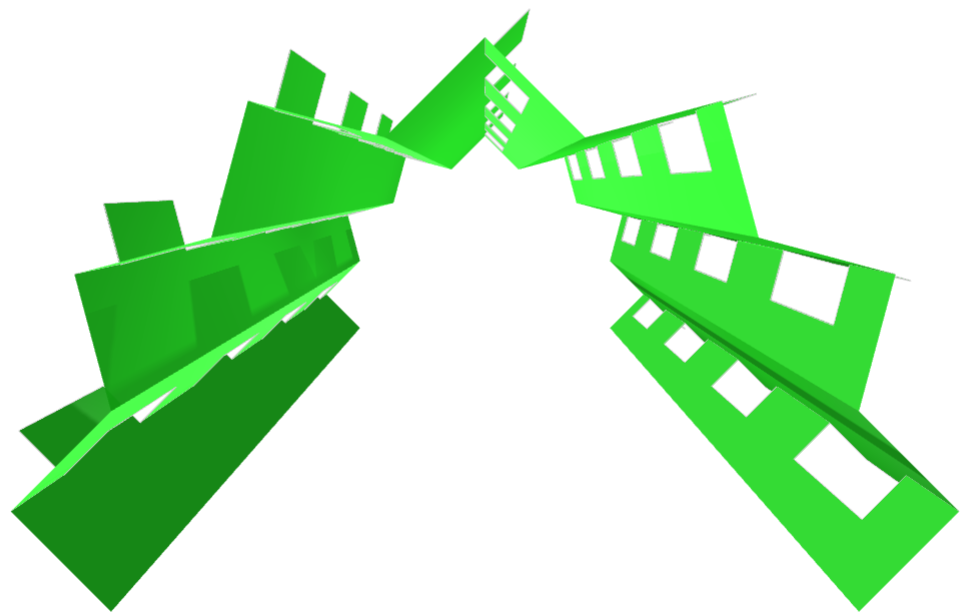</a>
  The polygonal model was built with repetitions simulating a portal (or tunnel), with shadow effects.
  

<h4>4. Pentagonal model: table</h4>

  The pentagonal model was built with repetitions simulating a kirigami table, with shadow effects.
  

<h4>5. Pentagonal model: cylinder</h4>
<a href="vr/modelo2a.htm" target="_blank" title="3D model" class="fotoA">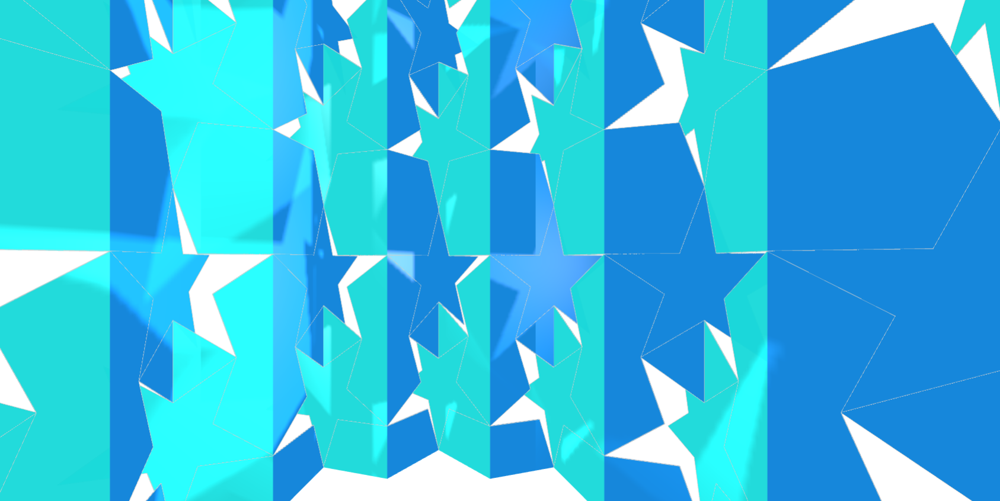</a>
  The pentagonal model was built with repetitions simulating a cylindrical tower, with shadow effects.
  

<h4>6. Pentagonal model: portal</h4>

  The pentagonal model was built with repetitions simulating a portal (or tunnel), with shadow effects.
  

<h4>7. Hexagonal model: table</h4>

  The hexagonal model was built with repetitions simulating a kirigami table, with shadow effects.
  

<h4>8. Hexagonal model: cylinder</h4>
<a href="vr/modelo3a.htm" target="_blank" title="3D model" class="fotoA">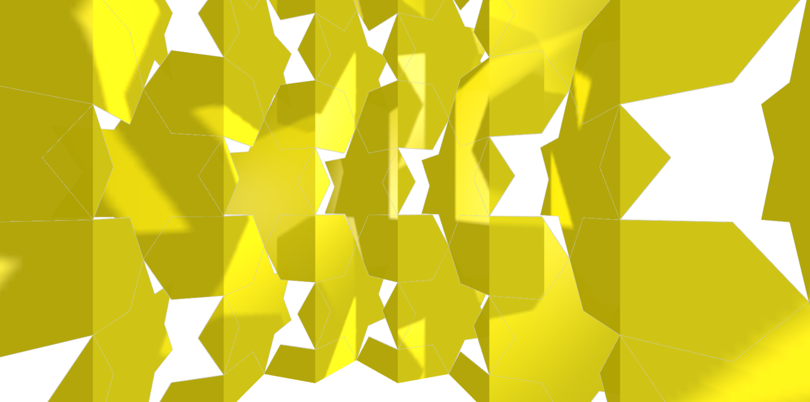</a>
  The hexagonal model was built with repetitions simulating a cylindrical tower, with shadow effects.
  

<h4>9. Hexagonal model: portal</h4>
<a href="vr/modelo3ar.htm" target="_blank" title="3D model" class="fotoA">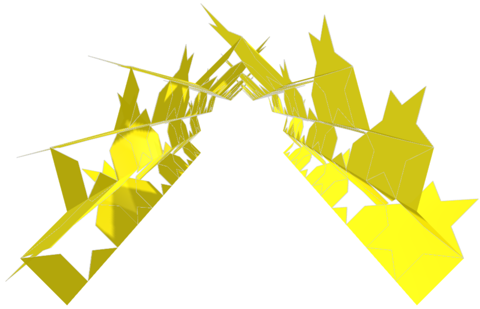</a>
  The hexagonal model was built with repetitions simulating a portal (or tunnel), with shadow effects.
  

<h4>10. Polygonal model 2: table</h4>

  The polygonal model was built with repetitions simulating a kirigami table, with shadow effects.
  

<a href="#p1" class="topo">back to top</a>

<h4>11. Polygonal model 2: cylinder</h4>

  The polygonal model was built with repetitions simulating a cylindrical tower, with shadow effects.
  

<h4>12. Polygonal model 2: portal</h4>
<a href="vr/modelo4ar.htm" target="_blank" title="3D model" class="fotoA">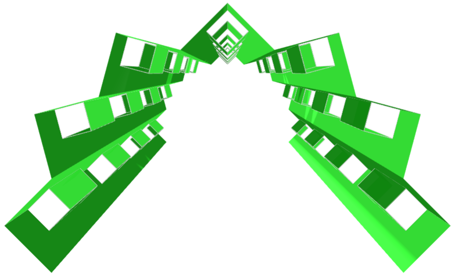</a>
  The polygonal model was built with repetitions simulating a portal (or tunnel), with shadow effects.
  

<h4>13. Pentagonal model: table</h4>

  The pentagonal model was built with repetitions simulating a kirigami table, with shadow effects.
  

<h4>14. Pentagonal model: cylinder</h4>

  The pentagonal model was built with repetitions simulating a cylindrical tower, with shadow effects.
  

<h4>15. Pentagonal model: portal</h4>

  The pentagonal model was built with repetitions simulating a portal (or tunnel), with shadow effects.
  

<h4>16. Hexagonal model: table</h4>
<a href="vr/modelo6.htm" target="_blank" title="3D model" class="fotoA">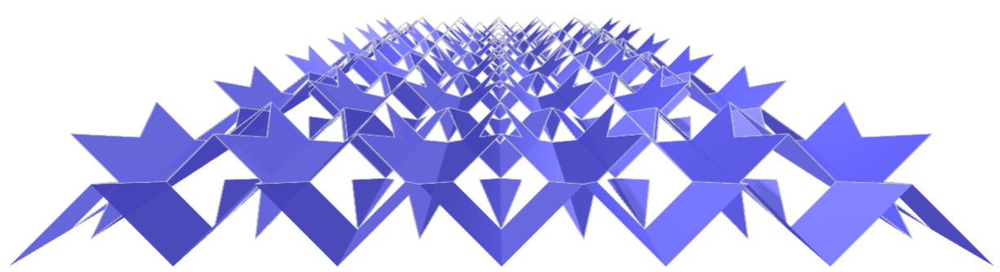</a>
  The hexagonal model was built with repetitions simulating a kirigami table, with shadow effects.
  

<h4>17. Hexagonal model: cylinder</h4>

  The hexagonal model was built with repetitions simulating a cylindrical tower, with shadow effects.
  

<h4>18. Hexagonal model: portal</h4>
<a href="vr/modelo6ar.htm" target="_blank" title="3D model" class="fotoA">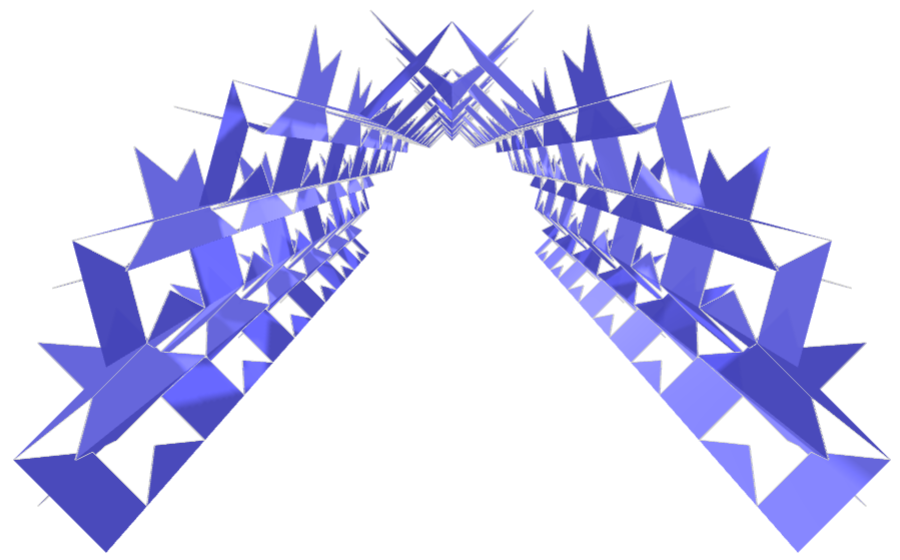</a>
  The hexagonal model was built with repetitions simulating a portal (or tunnel), with shadow effects.
  

<h4>19. Polygonal model 3: table</h4>
<a href="vr/modelo7.htm" target="_blank" title="3D model" class="fotoA">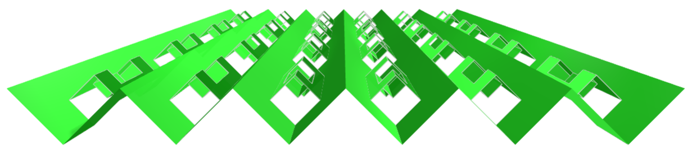</a>
  The polygonal model was built with repetitions simulating a kirigami table, with shadow effects.
  

<h4>20. Polygonal model 3: cylinder</h4>

  The polygonal model was built with repetitions simulating a cylindrical tower, with shadow effects.
  

<a href="#p1" class="topo">back to top</a>

<h4>21. Polygonal model 3: portal</h4>
<a href="vr/modelo7ar.htm" target="_blank" title="3D model" class="fotoA">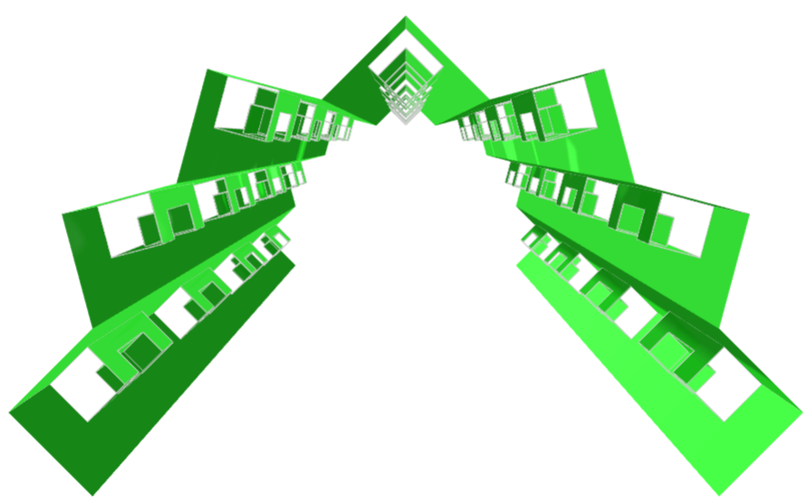</a>
  The polygonal model was built with repetitions simulating a portal (or tunnel), with shadow effects.
  

<h4>22. Pentagonal model: table</h4>
<a href="vr/modelo8.htm" target="_blank" title="3D model" class="fotoA">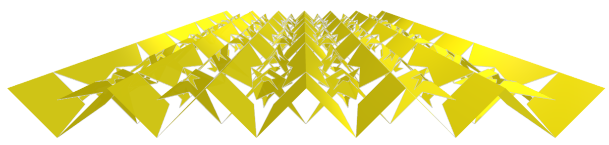</a>
  The pentagonal model was built with repetitions simulating a kirigami table, with shadow effects.
  

<h4>23. Pentagonal model: cylinder</h4>
<a href="vr/modelo8a.htm" target="_blank" title="3D model" class="fotoA">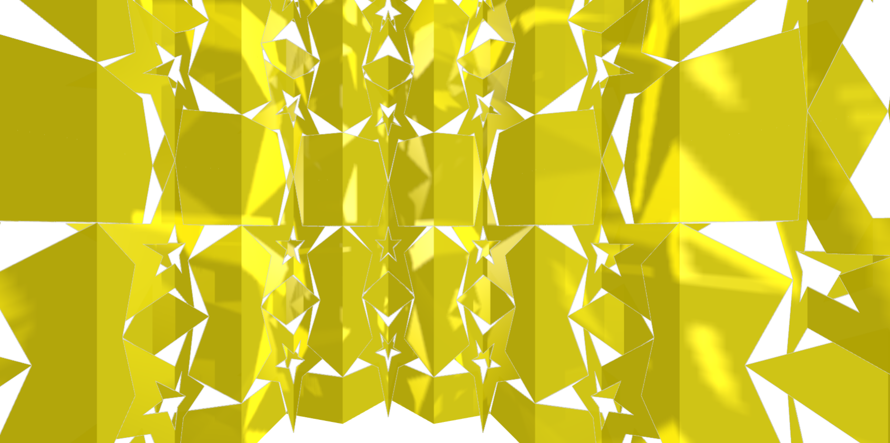</a>
  The pentagonal model was built with repetitions simulating a cylindrical tower, with shadow effects.
  

<h4>24. Pentagonal model: portal</h4>

  The pentagonal model was built with repetitions simulating a portal (or tunnel), with shadow effects.
  

<h4>25. Hexagonal model: table</h4>

  The hexagonal model was built with repetitions simulating a kirigami table, with shadow effects.
  

<h4>26. Hexagonal model: cylinder</h4>
<a href="vr/modelo9a.htm" target="_blank" title="3D model" class="fotoA">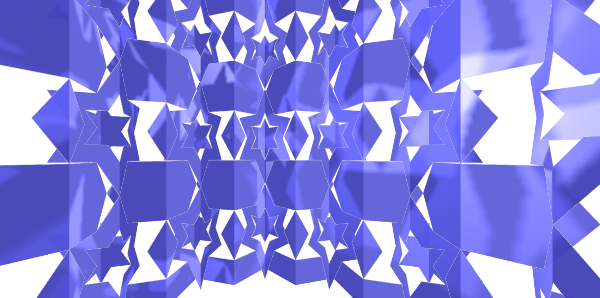</a>
  The hexagonal model was built with repetitions simulating a cylindrical tower, with shadow effects.
  

<h4>27. Hexagonal model: portal</h4>

  The hexagonal model was built with repetitions simulating a portal (or tunnel), with shadow effects.
  

<h4>28. Pentagonal model: table</h4>

  The pentagonal model was built with repetitions simulating a kirigami table, with shadow effects.
  

<h4>29. Pentagonal model: cylinder</h4>

  The pentagonal model was built with repetitions simulating a cylindrical tower, with shadow effects.
  

<h4>30. Pentagonal model: portal</h4>
<a href="vr/modelo8cr.htm" target="_blank" title="3D model" class="fotoA">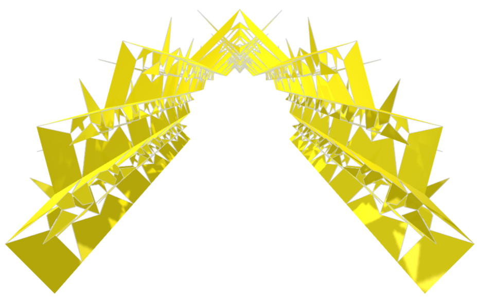</a>
  The pentagonal model was built with repetitions simulating a portal (or tunnel), with shadow effects.
  

<a href="#p1" class="topo">back to top</a>

<h4>31. Hexagonal model: table</h4>

  The hexagonal model was built with repetitions simulating a kirigami table, with shadow effects.
  

<h4>32. Hexagonal model: cylinder</h4>
<a href="vr/modelo9c.htm" target="_blank" title="3D model" class="fotoA">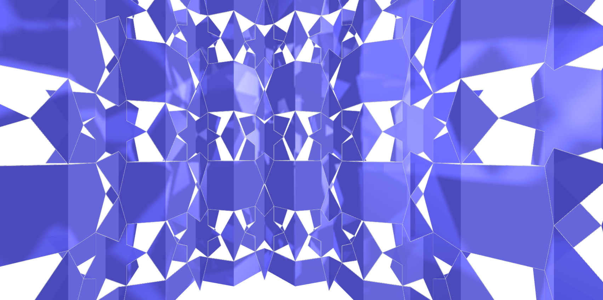</a>
  The hexagonal model was built with repetitions simulating a cylindrical tower, with shadow effects.
  

<h4>33. Hexagonal model: portal</h4>

  The hexagonal model was built with repetitions simulating a portal (or tunnel), with shadow effects.
  

<h4>34. Floral model 1: table</h4>

  The floral model was built with repetitions simulating a kirigami table, with shadow effects.
  

<h4>35. Floral model 1: cylinder</h4>

  The floral model was built with repetitions simulating a cylindrical tower, with shadow effects.
  

<h4>36. Floral model 1: portal</h4>

  The floral model was built with repetitions simulating a portal (or tunnel), with shadow effects.
  

<h4>37. Floral model 2: table</h4>
<a href="vr/flor2.htm" target="_blank" title="3D model" class="fotoA">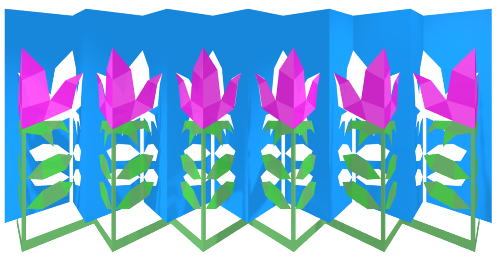</a>
  The floral model was built with repetitions simulating a kirigami table, with shadow effects.
  

<h4>38. Floral model 2: cylinder</h4>
<a href="vr/flor2a.htm" target="_blank" title="3D model" class="fotoA">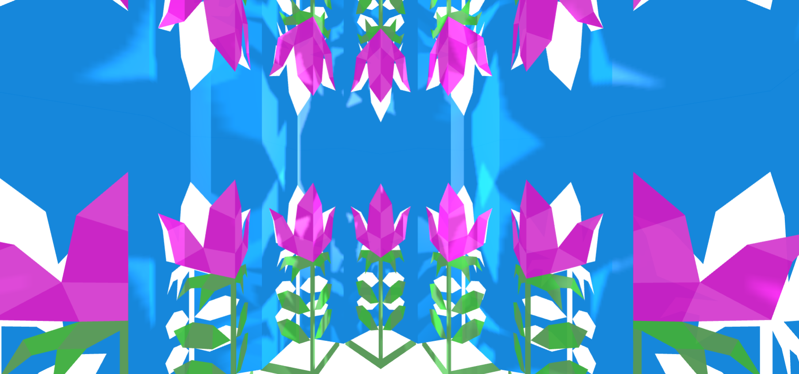</a>
  The floral model was built with repetitions simulating a cylindrical tower, with shadow effects.
  

<h4>39. Floral model 2: portal</h4>

  The floral model was built with repetitions simulating a portal (or tunnel), with shadow effects.
  

<a href="#p1" class="topo">back to top</a>

  Polygonal kirigamis: visualization with Virtual Reality by <a xmlns:cc="http://creativecommons.org/ns#" href="https://paulohscwb.github.io/kirigami/parte1/" property="cc:attributionName" rel="cc:attributionURL">Paulo Henrique Siqueira</a> is licensed with a license <a rel="license" href="http://creativecommons.org/licenses/by-nc-nd/4.0/">Creative Commons Attribution-NonCommercial-NoDerivatives 4.0 International</a>.

<h4>How to cite this work:</h4> 

Siqueira, P.H., "Polygonal kirigamis: visualization with Virtual Reality". Available in: <https://paulohscwb.github.io/kirigami/parte1/>, August 2025.

<!---->
  <b>References:</b>
 Otsu, G. M., Yamada, T. R. U. "Kirigami 3D aplicado: uma proposta em design de produto dobrável. Revista Brasileira de Expressão Gráfica, v. 7, n. 1, 2019 <a href="https://www.rbeg.net/index.php/rbeg/article/view/73" target="_blank">https://www.rbeg.net/index.php/rbeg/article/view/73</a>
 Khalilzadehtabrizi, S., Mohagheghian, I., Walker, M. G., Analysis and design of Kirigami-based metallic energy-dissipating systems, Thin-Walled Structures, v 212, 2025 <a href="https://doi.org/10.1016/j.tws.2025.113127" target="_blank">https://doi.org/10.1016/j.tws.2025.113127</a>
