<link rel="stylesheet" href="../../scripts/style.css">
<meta charset="utf-8">
<link rel="icon" type="image/png" href="../vr/salas/imagens/icone.png">
<h2>Visualização de Kirigamis com Realidade Virtual (RV) em A-frame</h2>
<b>autor:</b> Paulo Henrique Siqueira - Universidade Federal do Paraná
 <b>contato:</b> <a href="#"> paulohscwb@gmail.com </a>
 <a href="https://paulohscwb.github.io/kirigami/parte1/">english version</a>
<form style="margin: 0 auto; float:right; text-align:right; width:100%; margin-bottom:15px;">
	<select id="url" onchange="urlHandler(this.value)" style="color:royalblue;">
		<option disabled selected>Mais sólidos:</option>
		<option disabled value="../../parte1/pt-br/">Poligonais</option>
		<!--<option value="../../parte2/pt-br/">Temas florais</option>-->
	</select>
</form>

  <h2 align="center">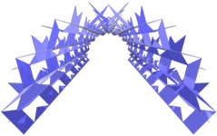 Kirigamis poligonais</h2>
  O Kirigami é uma arte tradicional japonesa que significa "recortar papel" (kiru - recortar, kami - papel). Trata-se de uma variação do origami, que combina a técnica de dobrar o papel com a arte de recortá-lo para criar figuras tridimensionais e efeitos interessantes de sombras. 
 O origami utiliza apenas dobras, enquanto o kirigami introduz cortes para dar volume e alguma complexidade às formas, podendo ser usado em decorações, cartões, maquetes e outros objetos. 
 Este trabalho mostra a arte do kirigami de uma forma um pouco diferente: as folhas são modeladas em arquivos para visualização em Realidade Virtual (RV).
 
<a href="#m3d">Modelos 3D</a>&nbsp;&nbsp;|&nbsp;&nbsp;<a href="../../pt-br/">Página Inicial</a>

  

 

<h3 id="m3d" align="center">Modelos 3D</h3>
<!--<iframe width="560" height="315" style="max-width:100%" src="https://www.youtube.com/embed/videoseries?list=PLy0I_lGW8HxXE37-GzEiObaiU6cwZwb6y" title="YouTube video player" frameborder="0" allow="accelerometer; autoplay; clipboard-write; encrypted-media; gyroscope; picture-in-picture; web-share" allowfullscreen></iframe>-->
<h4>1. Modelo poligonal 1: mesa</h4>
<a href="../vr/modelo1.htm" target="_blank" title="modelo 3D" class="fotoA">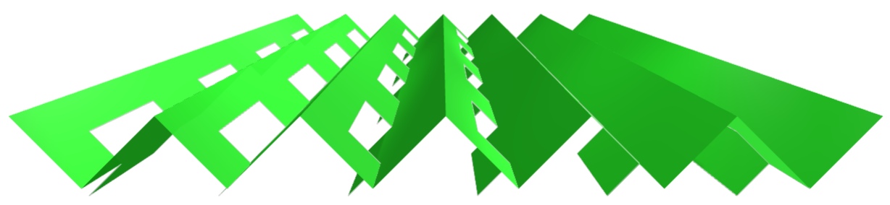</a>
  O modelo poligonal foi construído com repetições simulando uma mesa de kirigamis, com efeitos de sombras.
  

<h4>2. Modelo poligonal 1: cilindro</h4>
<a href="../vr/modelo1a.htm" target="_blank" title="modelo 3D" class="fotoA">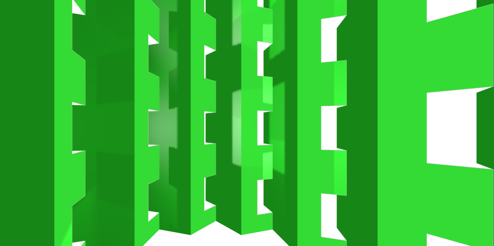</a>
  O modelo poligonal foi construído com repetições simulando uma torre cilíndrica, com efeitos de sombras.
  

<h4>3. Modelo poligonal 1: portal</h4>

  O modelo poligonal foi construído com repetições simulando um portal (ou túnel), com efeitos de sombras.
  

<h4>4. Modelo pentagonal: mesa</h4>

  O modelo pentagonal foi construído com repetições simulando uma mesa de kirigamis, com efeitos de sombras.
  

<h4>5. Modelo pentagonal: cilindro</h4>

  O modelo pentagonal foi construído com repetições simulando uma torre cilíndrica, com efeitos de sombras.
  

<h4>6. Modelo pentagonal: portal</h4>

  O modelo pentagonal foi construído com repetições simulando um portal (ou túnel), com efeitos de sombras.
  

<h4>7. Modelo hexagonal: mesa</h4>

  O modelo hexagonal foi construído com repetições simulando uma mesa de kirigamis, com efeitos de sombras.
  

<h4>8. Modelo hexagonal: cilindro</h4>

  O modelo hexagonal foi construído com repetições simulando uma torre cilíndrica, com efeitos de sombras.
  

<h4>9. Modelo hexagonal: portal</h4>

  O modelo hexagonal foi construído com repetições simulando um portal (ou túnel), com efeitos de sombras.
  
 

<h4>10. Modelo poligonal 2: mesa</h4>
<a href="../vr/modelo4.htm" target="_blank" title="modelo 3D" class="fotoA">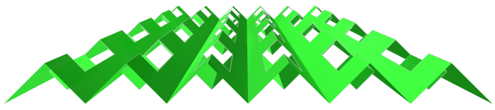</a>
  O modelo poligonal foi construído com repetições simulando uma mesa de kirigamis, com efeitos de sombras.
  

<a href="#p1" class="topo">voltar ao topo</a>

<h4>11. Modelo poligonal 2: cilindro</h4>
<a href="../vr/modelo4a.htm" target="_blank" title="modelo 3D" class="fotoA">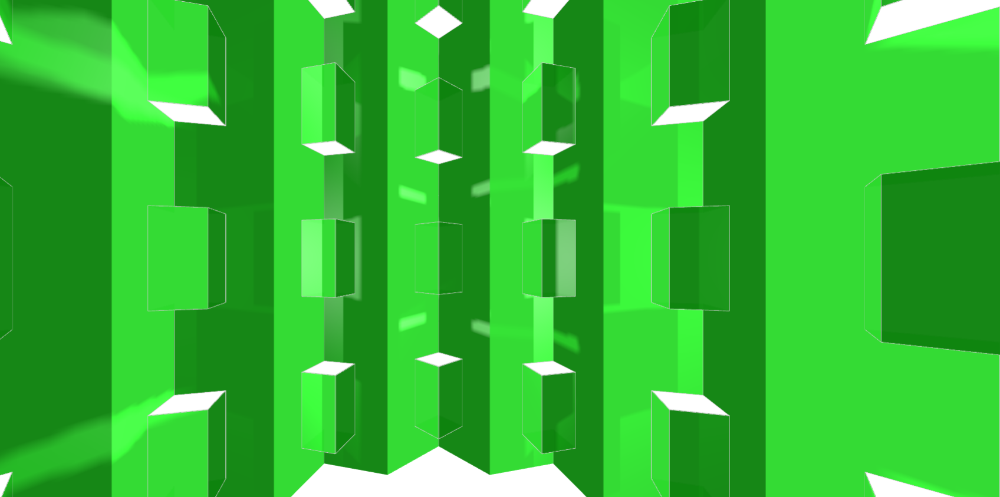</a>
  O modelo poligonal foi construído com repetições simulando uma torre cilíndrica, com efeitos de sombras.
  

<h4>12. Modelo poligonal 2: portal</h4>

  O modelo poligonal foi construído com repetições simulando um portal (ou túnel), com efeitos de sombras.
  
 

<h4>13. Modelo pentagonal: mesa</h4>

  O modelo pentagonal foi construído com repetições simulando uma mesa de kirigamis, com efeitos de sombras.
  

<h4>14. Modelo pentagonal: cilindro</h4>

  O modelo pentagonal foi construído com repetições simulando uma torre cilíndrica, com efeitos de sombras.
  

<h4>15. Modelo pentagonal: portal</h4>

  O modelo pentagonal foi construído com repetições simulando um portal (ou túnel), com efeitos de sombras.
  

<h4>16. Modelo hexagonal: mesa</h4>

  O modelo hexagonal foi construído com repetições simulando uma mesa de kirigamis, com efeitos de sombras.
  

<h4>17. Modelo hexagonal: cilindro</h4>
<a href="../vr/modelo6a.htm" target="_blank" title="modelo 3D" class="fotoA">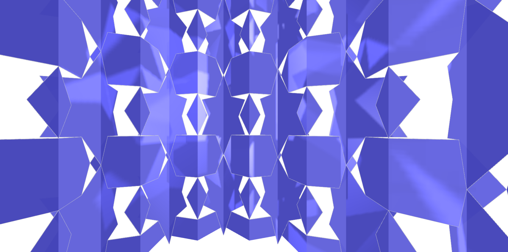</a>
  O modelo hexagonal foi construído com repetições simulando uma torre cilíndrica, com efeitos de sombras.
  

<h4>18. Modelo hexagonal: portal</h4>

  O modelo hexagonal foi construído com repetições simulando um portal (ou túnel), com efeitos de sombras.
  

<h4>19. Modelo poligonal 3: mesa</h4>

  O modelo poligonal foi construído com repetições simulando uma mesa de kirigamis, com efeitos de sombras.
  

<h4>20. Modelo poligonal 3: cilindro</h4>
<a href="../vr/modelo7a.htm" target="_blank" title="modelo 3D" class="fotoA">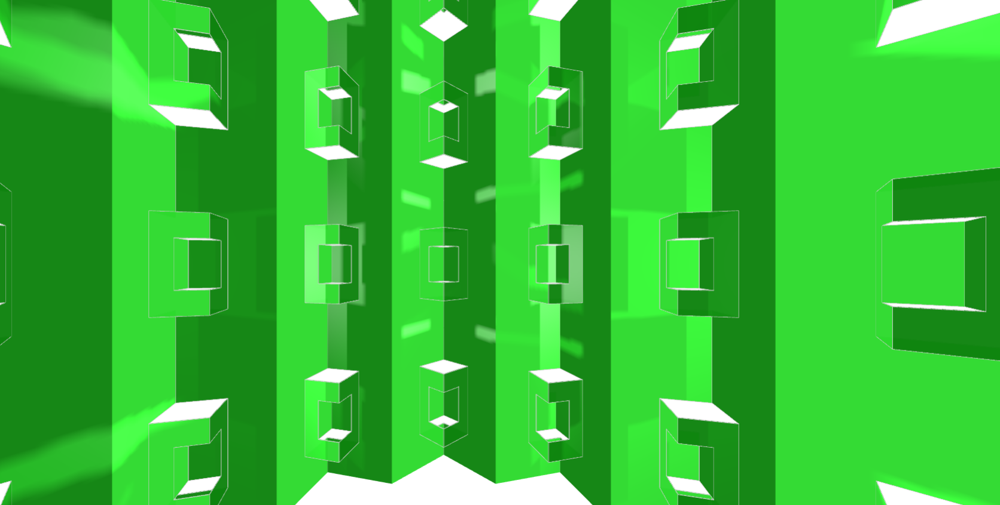</a>
  O modelo poligonal foi construído com repetições simulando uma torre cilíndrica, com efeitos de sombras.
  

<a href="#p1" class="topo">voltar ao topo</a>

<h4>21. Modelo poligonal 3: portal</h4>

  O modelo poligonal foi construído com repetições simulando um portal (ou túnel), com efeitos de sombras.
  
 

<h4>22. Modelo pentagonal: mesa</h4>

  O modelo pentagonal foi construído com repetições simulando uma mesa de kirigamis, com efeitos de sombras.
  

<h4>23. Modelo pentagonal: cilindro</h4>

  O modelo pentagonal foi construído com repetições simulando uma torre cilíndrica, com efeitos de sombras.
  

<h4>24. Modelo pentagonal: portal</h4>
<a href="../vr/modelo8ar.htm" target="_blank" title="modelo 3D" class="fotoA">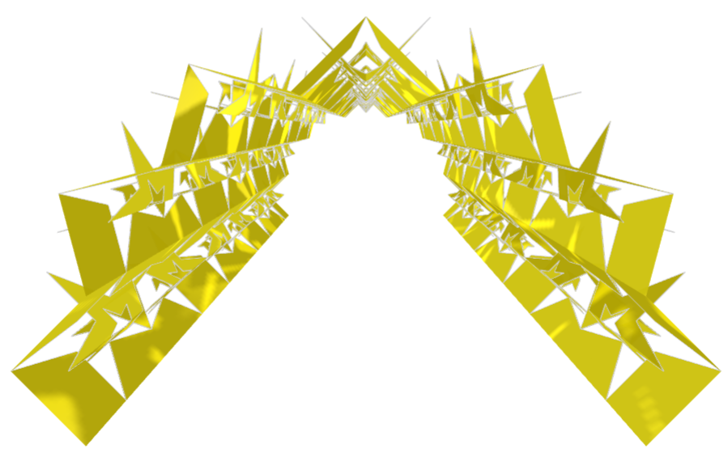</a>
  O modelo pentagonal foi construído com repetições simulando um portal (ou túnel), com efeitos de sombras.
  

<h4>25. Modelo hexagonal: mesa</h4>
<a href="../vr/modelo9.htm" target="_blank" title="modelo 3D" class="fotoA">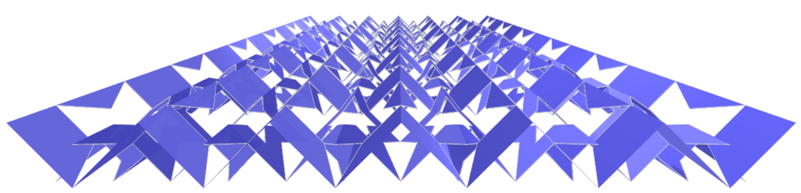</a>
  O modelo hexagonal foi construído com repetições simulando uma mesa de kirigamis, com efeitos de sombras.
  

<h4>26. Modelo hexagonal: cilindro</h4>

  O modelo hexagonal foi construído com repetições simulando uma torre cilíndrica, com efeitos de sombras.
  

<h4>27. Modelo hexagonal: portal</h4>

  O modelo hexagonal foi construído com repetições simulando um portal (ou túnel), com efeitos de sombras.
  

<h4>28. Modelo pentagonal: mesa</h4>
<a href="../vr/modelo8b.htm" target="_blank" title="modelo 3D" class="fotoA">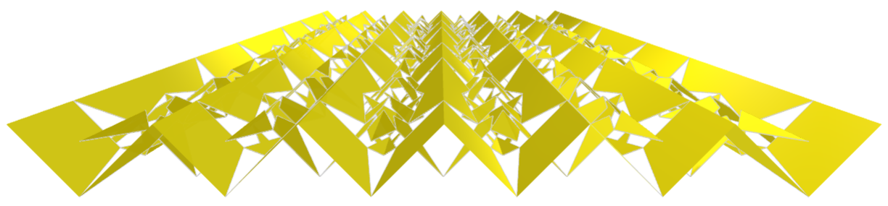</a>
  O modelo pentagonal foi construído com repetições simulando uma mesa de kirigamis, com efeitos de sombras.
  

<h4>29. Modelo pentagonal: cilindro</h4>

  O modelo pentagonal foi construído com repetições simulando uma torre cilíndrica, com efeitos de sombras.
  

<h4>30. Modelo pentagonal: portal</h4>

  O modelo pentagonal foi construído com repetições simulando um portal (ou túnel), com efeitos de sombras.
  

<a href="#p1" class="topo">voltar ao topo</a>

<h4>31. Modelo hexagonal: mesa</h4>
<a href="../vr/modelo9b.htm" target="_blank" title="modelo 3D" class="fotoA">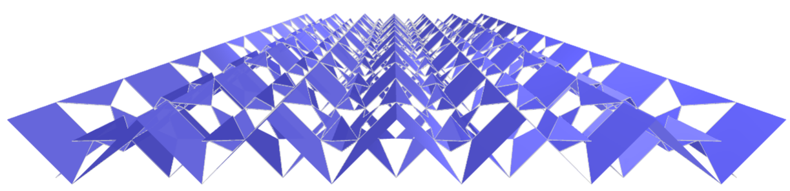</a>
  O modelo hexagonal foi construído com repetições simulando uma mesa de kirigamis, com efeitos de sombras.
  

<h4>32. Modelo hexagonal: cilindro</h4>

  O modelo hexagonal foi construído com repetições simulando uma torre cilíndrica, com efeitos de sombras.
  

<h4>33. Modelo hexagonal: portal</h4>
<a href="../vr/modelo9cr.htm" target="_blank" title="modelo 3D" class="fotoA">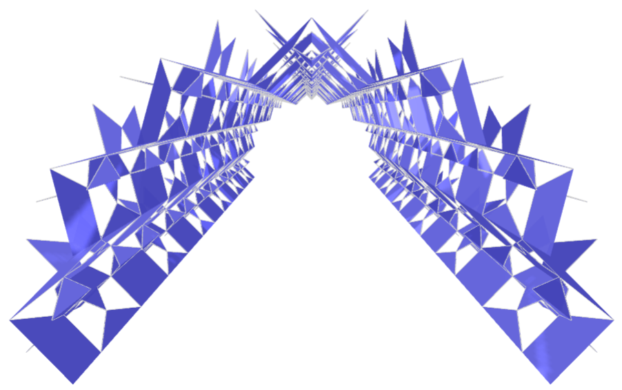</a>
  O modelo hexagonal foi construído com repetições simulando um portal (ou túnel), com efeitos de sombras.
  

<h4>34. Modelo floral 1: parede</h4>

  O modelo floral foi construído com repetições simulando uma parede de kirigamis, com efeitos de sombras.
  

<h4>35. Modelo floral 1: cilindro</h4>

  O modelo floral foi construído com repetições simulando uma torre cilíndrica, com efeitos de sombras.
  

<h4>36. Modelo floral 1: portal</h4>

  O modelo floral foi construído com repetições simulando um portal (ou túnel), com efeitos de sombras.
  

<h4>37. Modelo floral 2: parede</h4>

  O modelo floral foi construído com repetições simulando uma parede de kirigamis, com efeitos de sombras.
  

<h4>38. Modelo floral 2: cilindro</h4>

  O modelo floral foi construído com repetições simulando uma torre cilíndrica, com efeitos de sombras.
  

<h4>39. Modelo floral 2: portal</h4>

  O modelo floral foi construído com repetições simulando um portal (ou túnel), com efeitos de sombras.
  

<a href="#p1" class="topo">voltar ao topo</a>

  Polygonal kirigamis: visualization with Virtual Reality de <a xmlns:cc="http://creativecommons.org/ns#" href="https://paulohscwb.github.io/kirigami/parte1/pt-br/" property="cc:attributionName" rel="cc:attributionURL">Paulo Henrique Siqueira</a> está licenciado com uma Licença <a rel="license" href="http://creativecommons.org/licenses/by-nc-nd/4.0/">Creative Commons Atribuição-NãoComercial-SemDerivações 4.0 Internacional</a>.
<h4>Como citar este trabalho:</h4> 

Siqueira, P.H., "Polygonal kirigamis: visualization with Virtual Reality". Disponível em: <https://paulohscwb.github.io/kirigami/parte1/pt-br/>, Agosto de 2025.

<!---->
  <b>Referências:</b>
 Otsu, G. M., Yamada, T. R. U. "Kirigami 3D aplicado: uma proposta em design de produto dobrável. Revista Brasileira de Expressão Gráfica, v. 7, n. 1, 2019 <a href="https://www.rbeg.net/index.php/rbeg/article/view/73" target="_blank">https://www.rbeg.net/index.php/rbeg/article/view/73</a>
 Khalilzadehtabrizi, S., Mohagheghian, I., Walker, M. G., Analysis and design of Kirigami-based metallic energy-dissipating systems, Thin-Walled Structures, v 212, 2025 <a href="https://doi.org/10.1016/j.tws.2025.113127" target="_blank">https://doi.org/10.1016/j.tws.2025.113127</a>
