<link rel="stylesheet" href="../scripts/style.css">
<meta charset="utf-8">
<link rel="icon" type="image/png" href="vr/salas/imagens/icone.png">
<h2>Visualization of Kirigamis with Virtual Reality (VR) in A-frame</h2>
 <b>author:</b> Paulo Henrique Siqueira - Universidade Federal do Paraná
  <b>contact:</b> <a href="#">paulohscwb@gmail.com</a>
  <a href="https://paulohscwb.github.io/kirigami/parte2/pt-br/">versão em português</a>
 <form style="margin: 0 auto; float:right; text-align:right; width:100%; margin-bottom:15px;">
	<select id="url" onchange="urlHandler(this.value)" style="color:royalblue;">
		<option disabled selected value>More kirigamis:</option>
		<option value="../parte1/">Polygonal and floral</option>
		<option disabled value="../parte2/">Curves and florals 1</option>
		<!--<option value="../parte3/">Curves and florals 2</option> -->
	</select>
</form>

  <h2 align="center">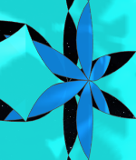 Curves and florals kirigamis 1</h2>
Kirigami is a traditional Japanese art form that means "paper cutting" (kiru - to cut, kami - paper). It is a variation of origami that combines the technique of folding paper with the art of cutting it to create three-dimensional figures and interesting shadow effects.
 Origami uses only folds, while kirigami introduces cuts to add volume and complexity to the shapes. It can be used in decorations, cards, models, and other objects.
 This work show the art of kirigami in a slightly different way: the sheets are modeled in files for viewing in Virtual Reality (VR).

<a href="#m3d">3D Models</a>&nbsp;&nbsp;|&nbsp;&nbsp;<a href="../">Home</a>

 

 

<h3 id="m3d" align="center">3D models</h3>
<iframe width="560" height="315" style="max-width:100%" src="https://www.youtube.com/embed/videoseries?list=PLy0I_lGW8HxXdyfe5NnpQcJvue5lG2s6l" title="YouTube video player" frameborder="0" allow="accelerometer; autoplay; clipboard-write; encrypted-media; gyroscope; picture-in-picture; web-share" allowfullscreen></iframe>
<h4>1. Triangular pinwheel model: wall</h4>
<a href="vr/cata1.htm" target="_blank" title="3D model" class="fotoA">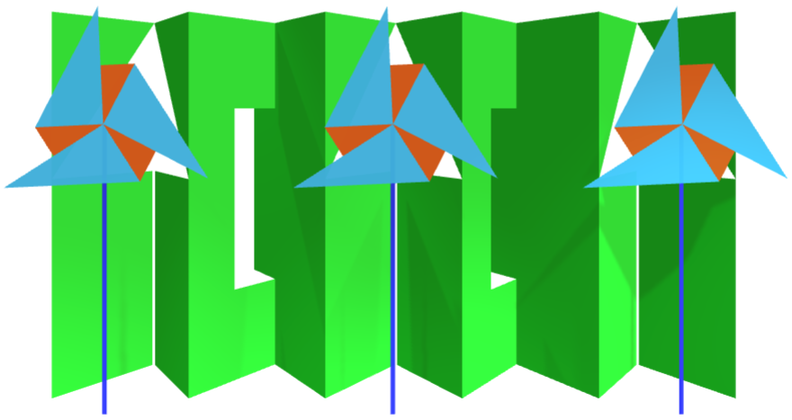</a>
  The triangular pinwheel model was built with repetitions simulating a kirigami wall, with shadow effects.
  

<h4>2. Triangular pinwheel model: cylinder</h4>
<a href="vr/cata1a.htm" target="_blank" title="3D model" class="fotoA">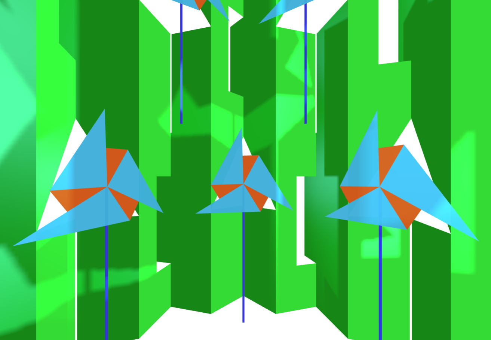</a>
  The triangular pinwheel model was built with repetitions simulating a cylindrical tower, with shadow effects.
  

<h4>3. Triangular pinwheel model: portal</h4>
<a href="vr/cata1ar.htm" target="_blank" title="3D model" class="fotoA">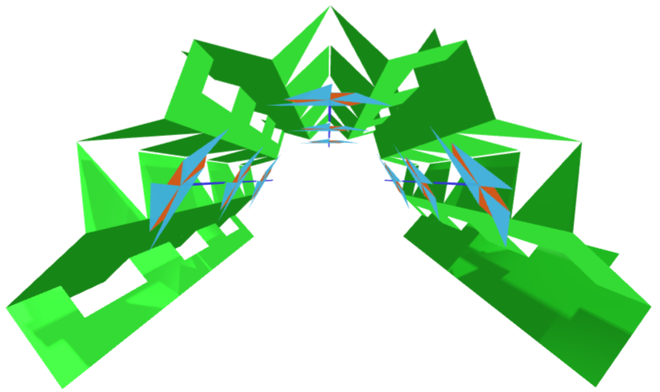</a>
  The triangular pinwheel model was built with repetitions simulating a portal (or tunnel), with shadow effects.
  

<h4>4. Square pinwheel model: wall</h4>
<a href="vr/cata2.htm" target="_blank" title="3D model" class="fotoA">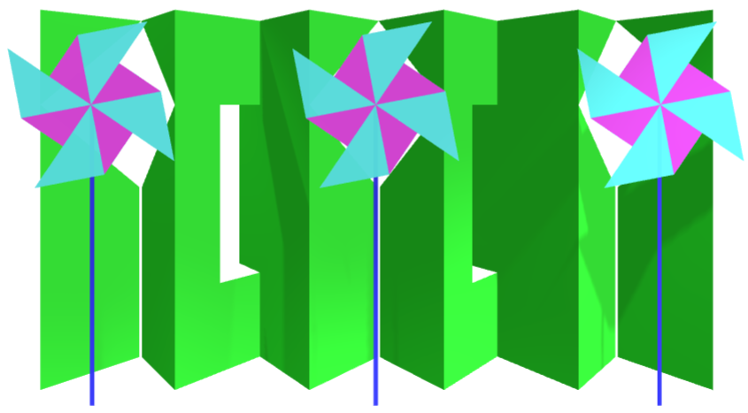</a>
  The square pinwheel model was built with repetitions simulating a kirigami wall, with shadow effects.
  

<h4>5. Square pinwheel model: cylinder</h4>
<a href="vr/cata2a.htm" target="_blank" title="3D model" class="fotoA">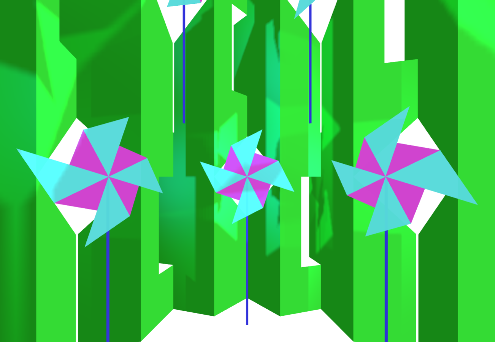</a>
  The square pinwheel model was built with repetitions simulating a cylindrical tower, with shadow effects.
  

<h4>6. Square pinwheel model: portal</h4>
<a href="vr/cata2ar.htm" target="_blank" title="3D model" class="fotoA">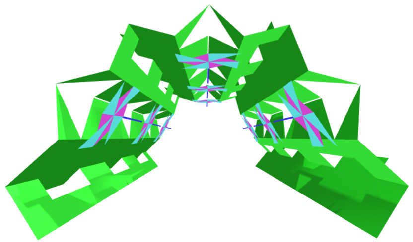</a>
  The square pinwheel model was built with repetitions simulating a portal (or tunnel), with shadow effects.
  

<h4>7. Curitiba sidewalk model: table</h4>
<a href="vr/curitiba.htm" target="_blank" title="3D model" class="fotoA">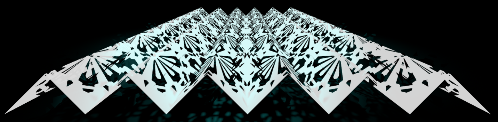</a>
  The Curitiba sidewalk model was built with repetitions simulating a kirigami table, with shadow effects.
  

<h4>8. Curitiba sidewalk model: cylinder</h4>
<a href="vr/curitibaa.htm" target="_blank" title="3D model" class="fotoA">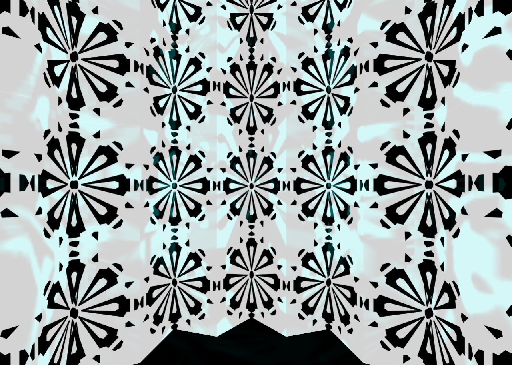</a>
  The Curitiba sidewalk model was built with repetitions simulating a cylindrical tower, with shadow effects.
  

<h4>9. Curitiba sidewalk model: portal</h4>
<a href="vr/curitibaar.htm" target="_blank" title="3D model" class="fotoA">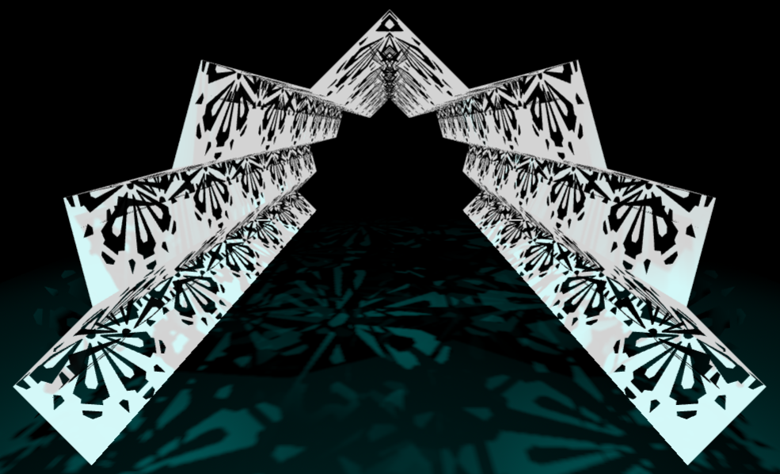</a>
  The Curitiba sidewalk model was built with repetitions simulating a portal (or tunnel), with shadow effects.
  

<h4>10. Floral model #3: wall</h4>
<a href="vr/flor3.htm" target="_blank" title="3D model" class="fotoA">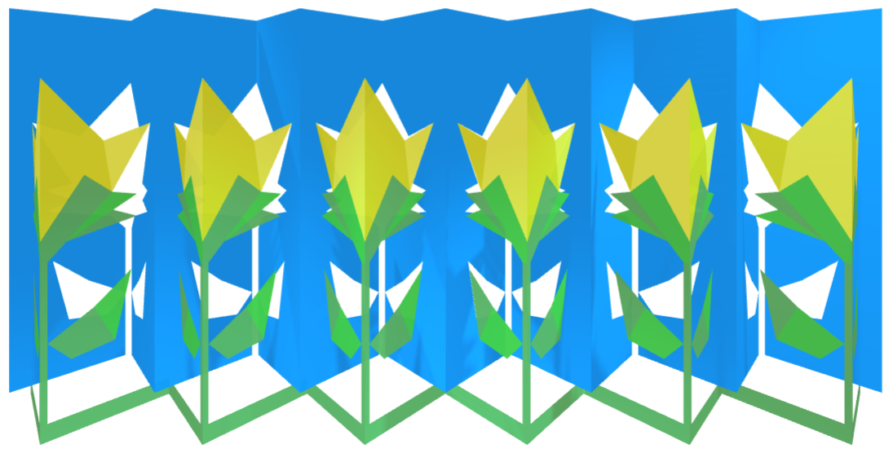</a>
  The floral model was built with repetitions simulating a kirigami wall, with shadow effects.
  

<a href="#p1" class="topo">back to top</a>

<h4>11. Floral model #3: cylinder</h4>
<a href="vr/flor3a.htm" target="_blank" title="3D model" class="fotoA">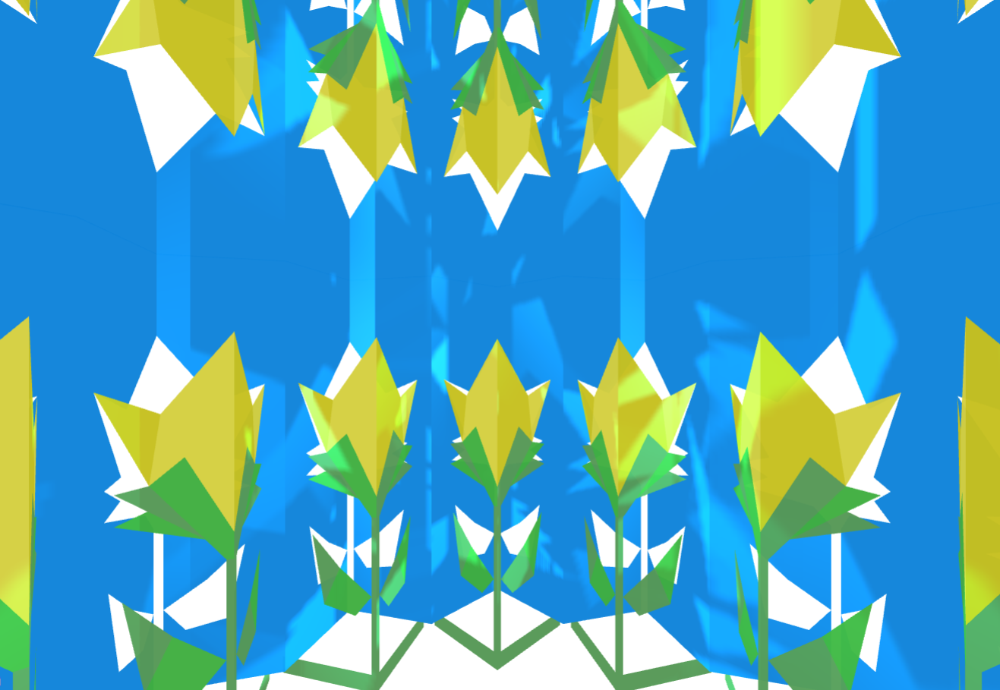</a>
  The floral model was built with repetitions simulating a cylindrical tower, with shadow effects.
  

<h4>12. Floral model #3: portal</h4>
<a href="vr/flor3ar.htm" target="_blank" title="3D model" class="fotoA">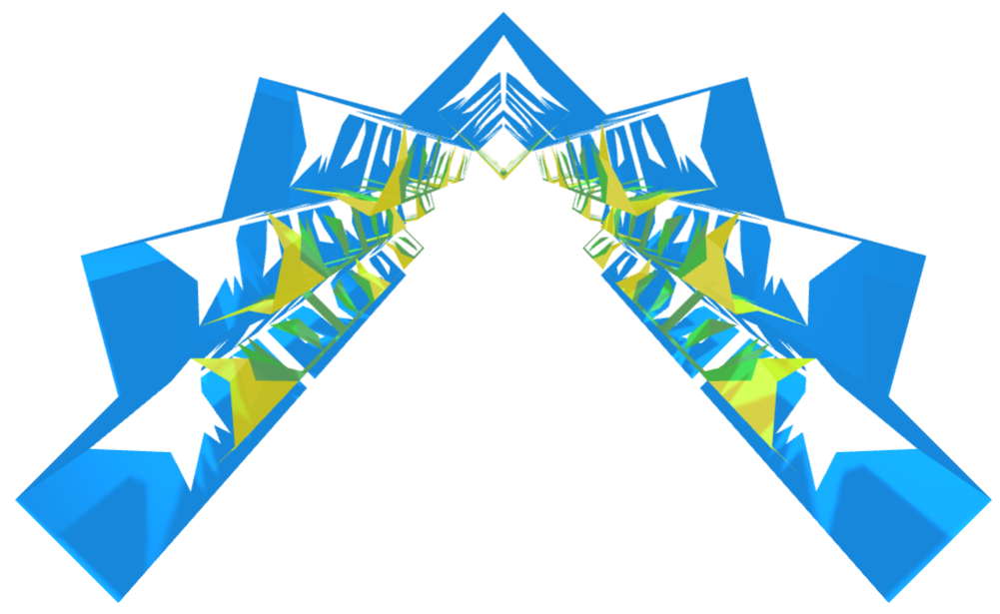</a>
  The floral model was built with repetitions simulating a portal (or tunnel), with shadow effects.
  

<h4>13. Floral model #4: wall</h4>
<a href="vr/flor4.htm" target="_blank" title="3D model" class="fotoA">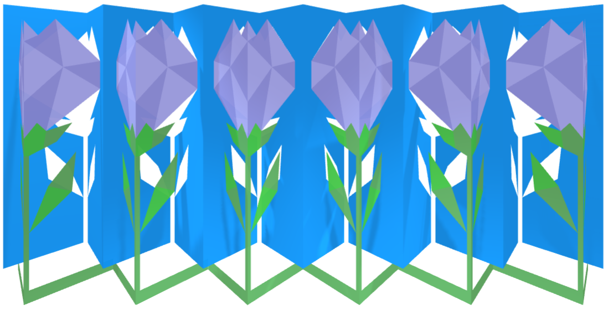</a>
  The floral model was built with repetitions simulating a kirigami wall, with shadow effects.
  

<h4>14. Floral model #4: cylinder</h4>
<a href="vr/flor4a.htm" target="_blank" title="3D model" class="fotoA">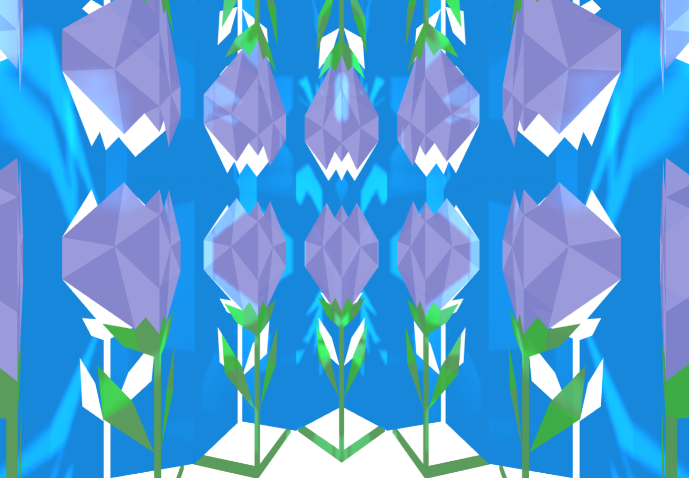</a>
  The floral model was built with repetitions simulating a cylindrical tower, with shadow effects.
  

<h4>15. Floral model #4: portal</h4>
<a href="vr/flor4ar.htm" target="_blank" title="3D model" class="fotoA">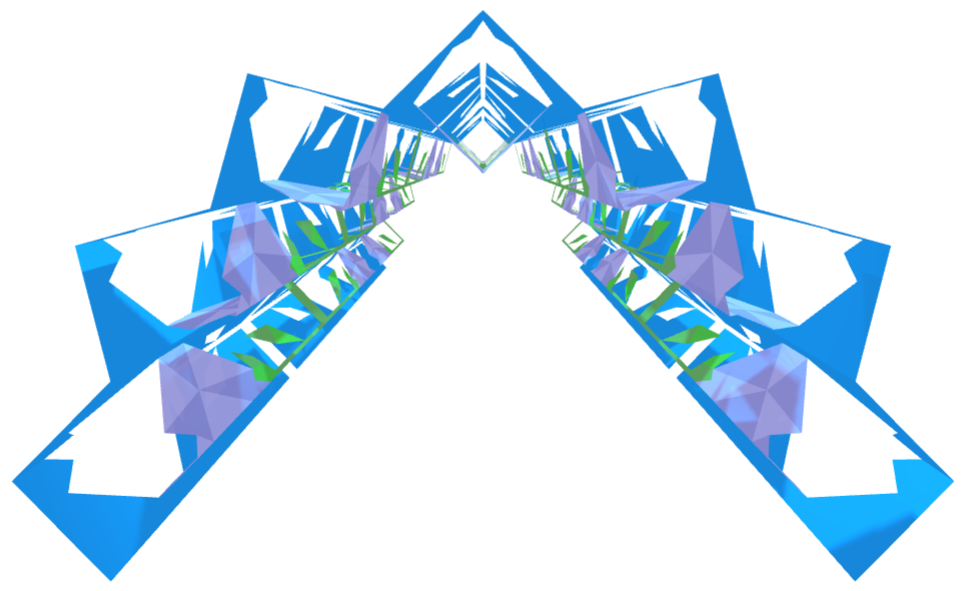</a>
  The floral model was built with repetitions simulating a portal (or tunnel), with shadow effects.
  

<h4>16. Floral model #5: wall</h4>
<a href="vr/flor5.htm" target="_blank" title="3D model" class="fotoA">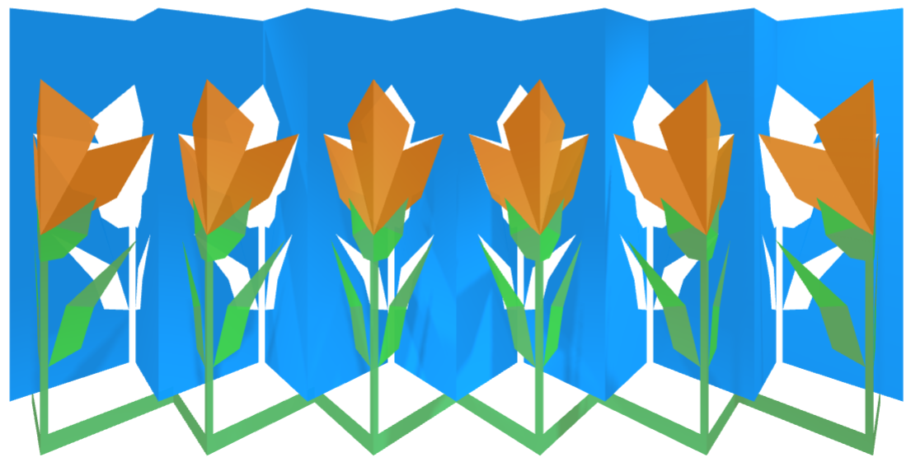</a>
  The floral model was built with repetitions simulating a kirigami wall, with shadow effects.
  

<h4>17. Floral model #5: cylinder</h4>
<a href="vr/flor5a.htm" target="_blank" title="3D model" class="fotoA">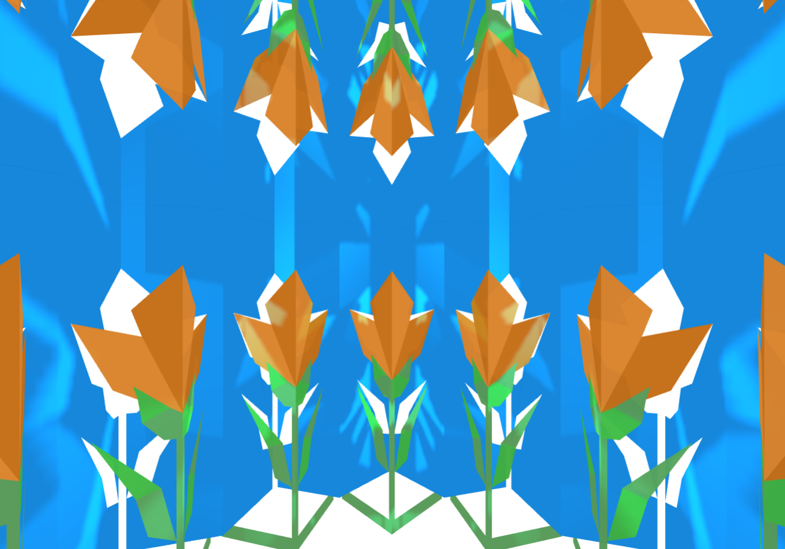</a>
  The floral model was built with repetitions simulating a cylindrical tower, with shadow effects.
  

<h4>18. Floral model #5: portal</h4>
<a href="vr/flor5ar.htm" target="_blank" title="3D model" class="fotoA">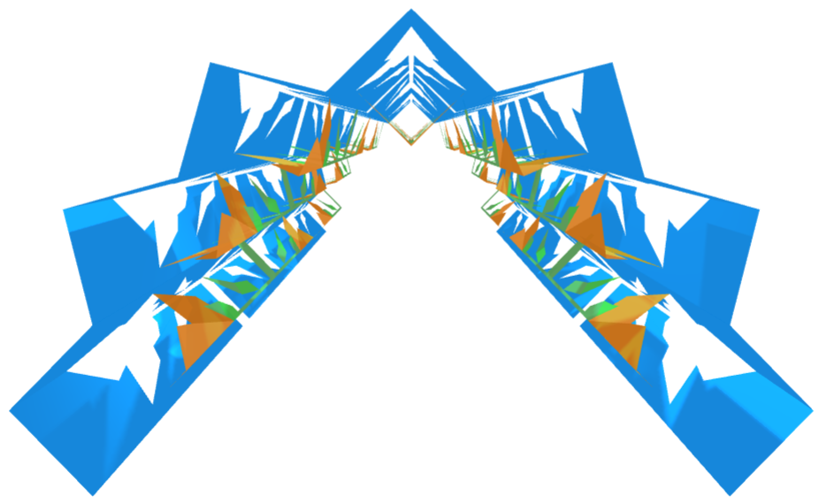</a>
  The floral model was built with repetitions simulating a portal (or tunnel), with shadow effects.
  

<h4>19. Pentagonal model: table</h4>
<a href="vr/modelo05b.htm" target="_blank" title="3D model" class="fotoA">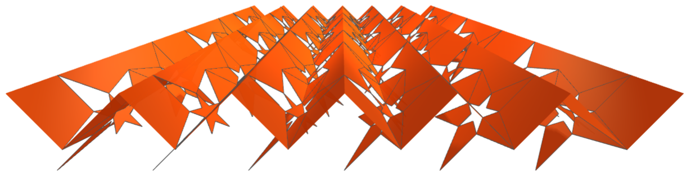</a>
  The pentagonal model was built with repetitions simulating a kirigami table, with shadow effects.
  

<h4>20. Pentagonal model: cylinder</h4>
<a href="vr/modelo05c.htm" target="_blank" title="3D model" class="fotoA">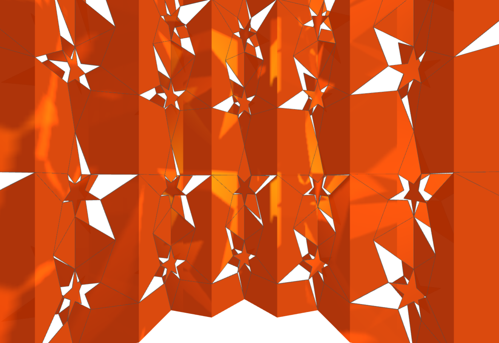</a>
  The pentagonal model was built with repetitions simulating a cylindrical tower, with shadow effects.
  

<a href="#p1" class="topo">back to top</a>

<h4>21. Pentagonal model: portal</h4>
<a href="vr/modelo05cr.htm" target="_blank" title="3D model" class="fotoA">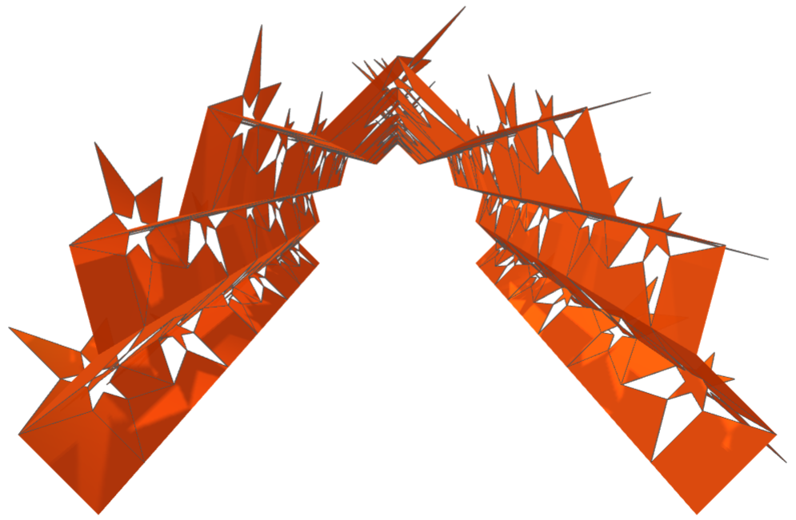</a>
  The pentagonal model was built with repetitions simulating a portal (or tunnel), with shadow effects.
  

<h4>22. Hexagonal model: table</h4>
<a href="vr/modelo06b.htm" target="_blank" title="3D model" class="fotoA">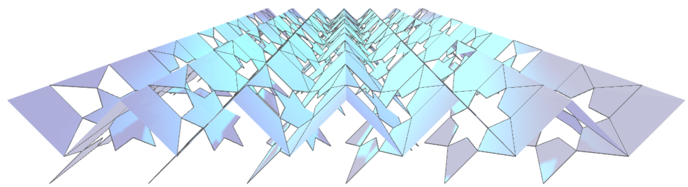</a>
  The hexagonal model was built with repetitions simulating a kirigami table, with shadow effects.
  

<h4>23. Hexagonal model: cylinder</h4>
<a href="vr/modelo06c.htm" target="_blank" title="3D model" class="fotoA">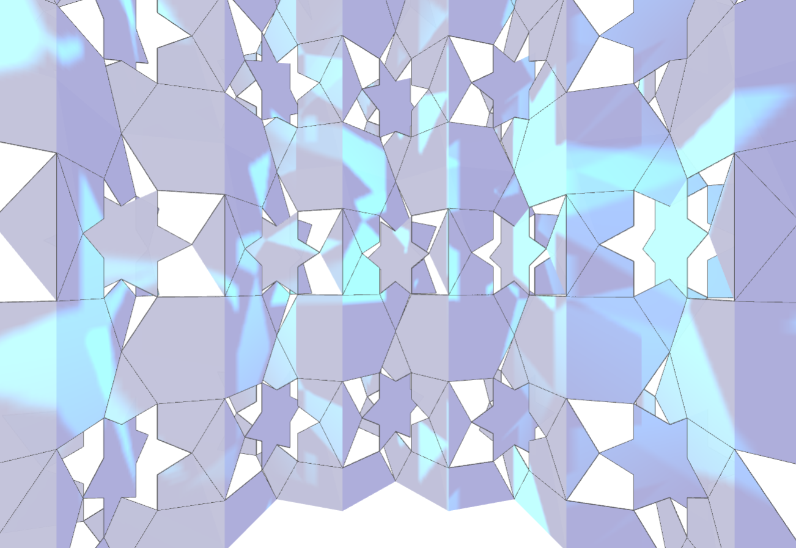</a>
  The hexagonal model was built with repetitions simulating a cylindrical tower, with shadow effects.
  

<h4>24. Hexagonal model: portal</h4>
<a href="vr/modelo06cr.htm" target="_blank" title="3D model" class="fotoA">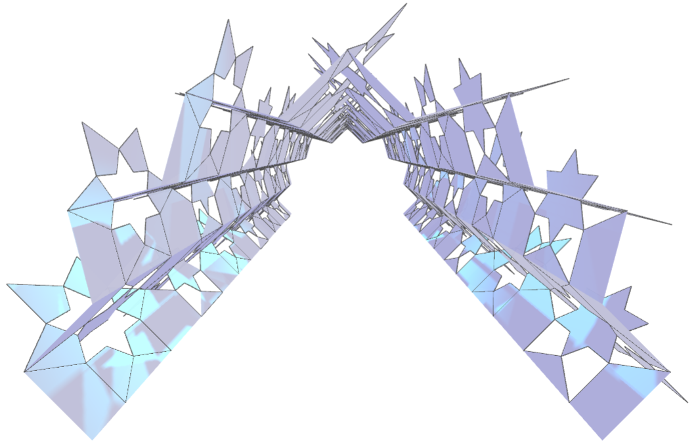</a>
  The hexagonal model was built with repetitions simulating a portal (or tunnel), with shadow effects.
  

<h4>25. Heptagonal model: table</h4>
<a href="vr/modelo07b.htm" target="_blank" title="3D model" class="fotoA">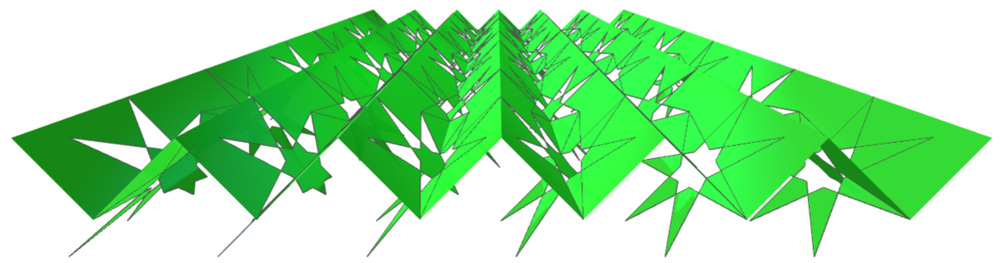</a>
  The heptagonal model was built with repetitions simulating a kirigami table, with shadow effects.
  

<h4>26. Heptagonal model: cylinder</h4>
<a href="vr/modelo07c.htm" target="_blank" title="3D model" class="fotoA">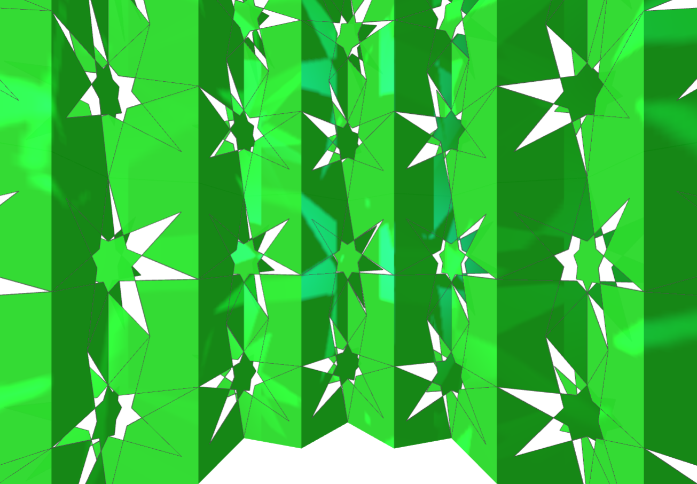</a>
  The heptagonal model was built with repetitions simulating a cylindrical tower, with shadow effects.
  

<h4>27. Heptagonal model: portal</h4>
<a href="vr/modelo07cr.htm" target="_blank" title="3D model" class="fotoA">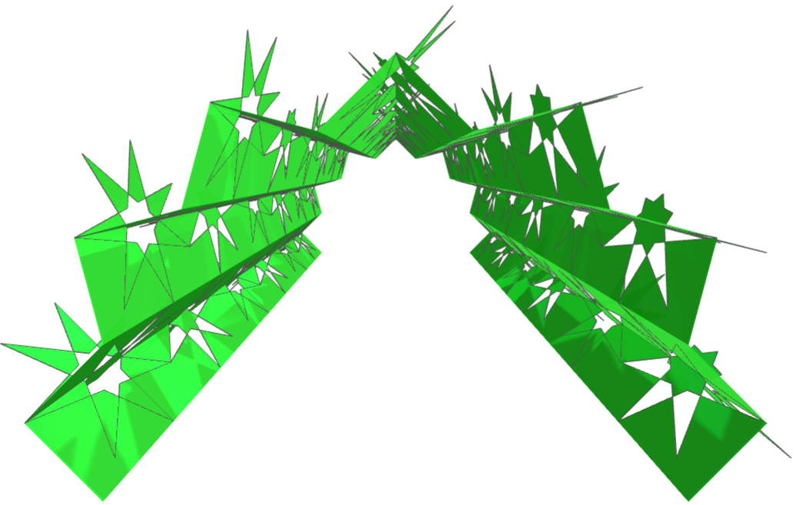</a>
  The heptagonal model was built with repetitions simulating a portal (or tunnel), with shadow effects.
  

<h4>28. Heptagonal model: table</h4>
<a href="vr/modelo10.htm" target="_blank" title="3D model" class="fotoA">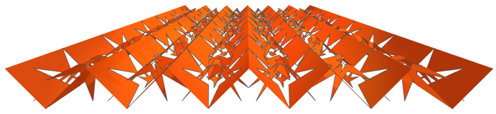</a>
  The heptagonal model was built with repetitions simulating a kirigami table, with shadow effects.
  

<h4>29. Heptagonal model: cylinder</h4>
<a href="vr/modelo10a.htm" target="_blank" title="3D model" class="fotoA">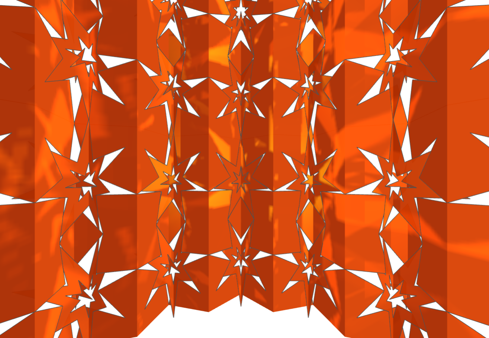</a>
  The heptagonal model was built with repetitions simulating a cylindrical tower, with shadow effects.
  

<h4>30. Heptagonal model: portal</h4>
<a href="vr/modelo10ar.htm" target="_blank" title="3D model" class="fotoA">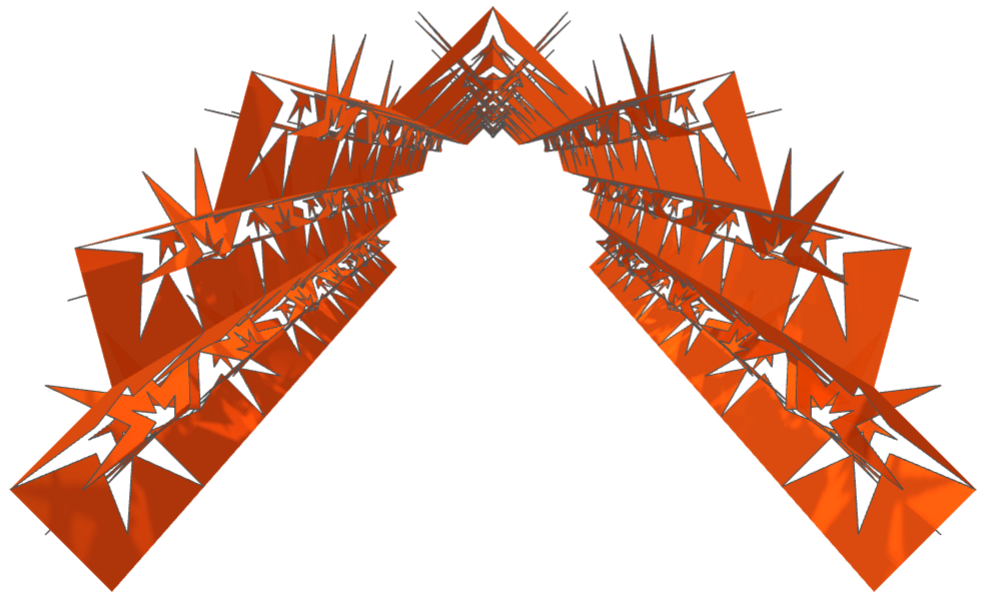</a>
  The heptagonal model was built with repetitions simulating a portal (or tunnel), with shadow effects.
  

<a href="#p1" class="topo">back to top</a>

<h4>31. Heptagonal model: table</h4>
<a href="vr/modelo10b.htm" target="_blank" title="3D model" class="fotoA">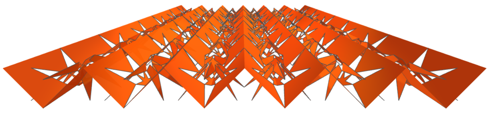</a>
  The heptagonal model was built with repetitions simulating a kirigami table, with shadow effects.
  

<h4>32. Heptagonal model: cylinder</h4>
<a href="vr/modelo10c.htm" target="_blank" title="3D model" class="fotoA">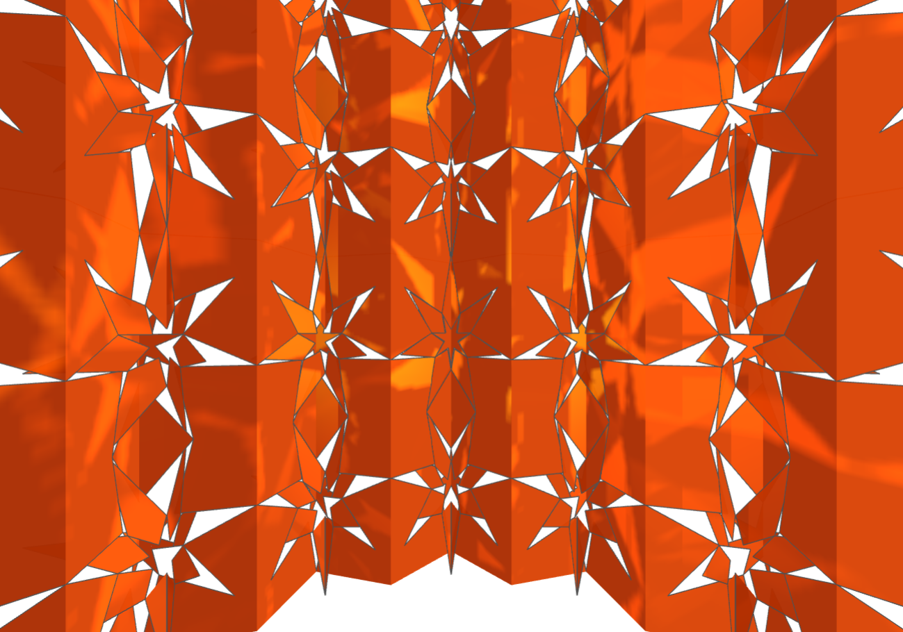</a>
  The heptagonal model was built with repetitions simulating a cylindrical tower, with shadow effects.
  

<h4>33. Heptagonal model: portal</h4>
<a href="vr/modelo10cr.htm" target="_blank" title="3D model" class="fotoA">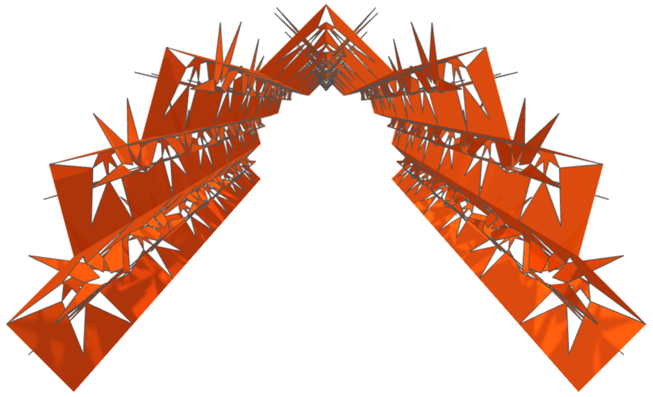</a>
  The heptagonal model was built with repetitions simulating a portal (or tunnel), with shadow effects.
  

<h4>34. Sidewalk model of Rio de Janeiro: table</h4>
<a href="vr/rio.htm" target="_blank" title="3D model" class="fotoA">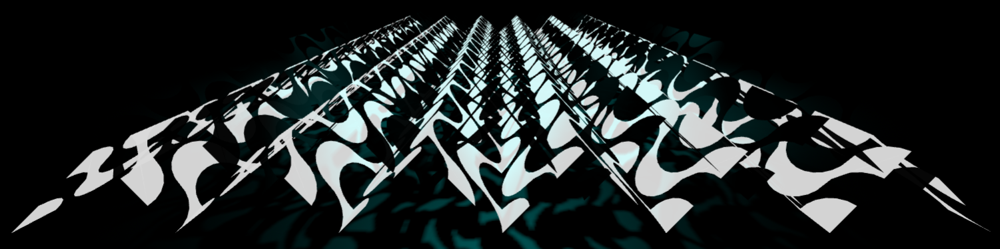</a>
  The sidewalk model of Rio de Janeiro was built with repetitions simulating a kirigami table, with shadow effects.
  

<h4>35. Sidewalk model of Rio de Janeiro: cylinder</h4>
<a href="vr/rioa.htm" target="_blank" title="3D model" class="fotoA">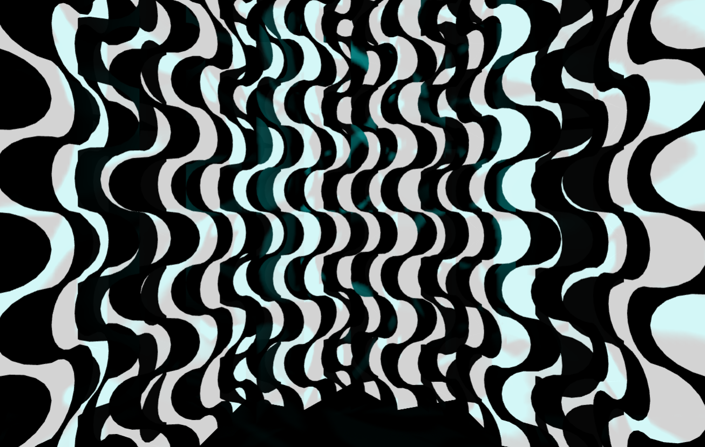</a>
  The sidewalk model of Rio de Janeiro was built with repetitions simulating a cylindrical tower, with shadow effects.
  

<h4>36. Sidewalk model of Rio de Janeiro: portal</h4>
<a href="vr/rioar.htm" target="_blank" title="3D model" class="fotoA">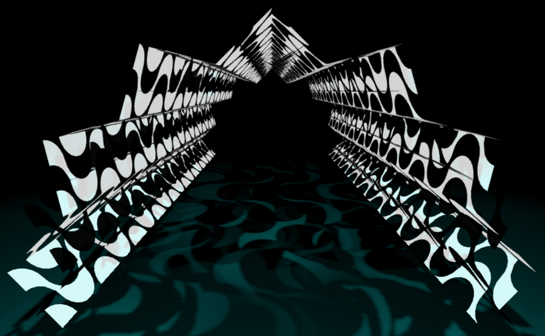</a>
  The sidewalk model of Rio de Janeiro was built with repetitions simulating a portal (or tunnel), with shadow effects.
  

<h4>37. Flower of life model: table</h4>
<a href="vr/seed1.htm" target="_blank" title="3D model" class="fotoA">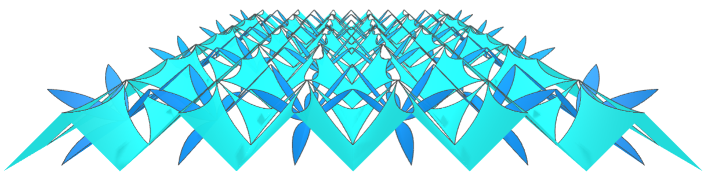</a>
  The flower of life model was built with repetitions simulating a kirigami table, with shadow effects.
  

<h4>38. Flower of life model: cylinder</h4>
<a href="vr/seed1a.htm" target="_blank" title="3D model" class="fotoA">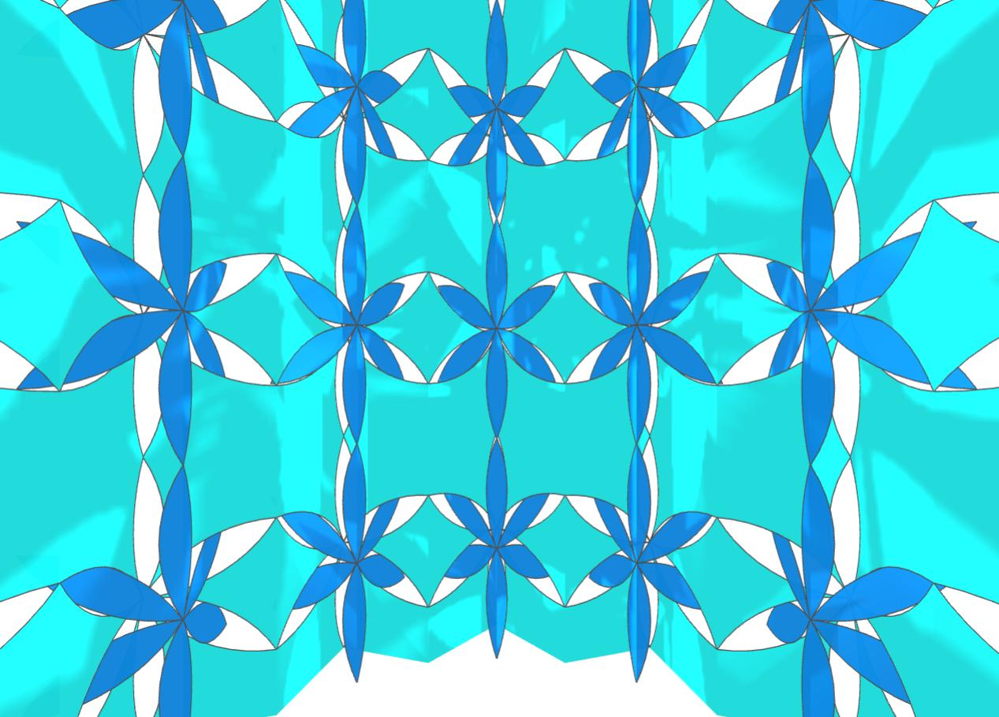</a>
  The flower of life model was built with repetitions simulating a cylindrical tower, with shadow effects.
  

<h4>39. Flower of life model: portal</h4>
<a href="vr/seed1ar.htm" target="_blank" title="3D model" class="fotoA">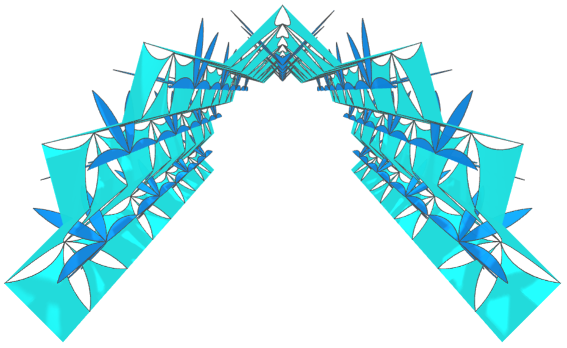</a>
  The flower of life model was built with repetitions simulating a portal (or tunnel), with shadow effects.
  

<a href="#p1" class="topo">back to top</a>

  Curves and florals kirigamis 1: visualization with Virtual Reality by <a xmlns:cc="http://creativecommons.org/ns#" href="https://paulohscwb.github.io/kirigami/parte2/" property="cc:attributionName" rel="cc:attributionURL">Paulo Henrique Siqueira</a> is licensed with a license <a rel="license" href="http://creativecommons.org/licenses/by-nc-nd/4.0/">Creative Commons Attribution-NonCommercial-NoDerivatives 4.0 International</a>.

<h4>How to cite this work:</h4> 

Siqueira, P.H., "Curves and florals kirigamis 1: visualization with Virtual Reality". Available in: <https://paulohscwb.github.io/kirigami/parte2/>, March 2026.

<!---->
  <b>References:</b>
 Otsu, G. M., Yamada, T. R. U. Kirigami 3D aplicado: uma proposta em design de produto dobrável. Revista Brasileira de Expressão Gráfica, v. 7, n. 1, 2019 <a href="https://www.rbeg.net/index.php/rbeg/article/view/73" target="_blank">https://www.rbeg.net/index.php/rbeg/article/view/73</a>
 Khalilzadehtabrizi, S., Mohagheghian, I., Walker, M. G., Analysis and design of Kirigami-based metallic energy-dissipating systems, Thin-Walled Structures, v 212, 2025 <a href="https://doi.org/10.1016/j.tws.2025.113127" target="_blank">https://doi.org/10.1016/j.tws.2025.113127</a>
 Yamada, T. R. U. Processo de Experimentação e criação de modelos autorais de Kirigami 3D baseados em técnicas de dobra e corte. In: Anais Graphica 2024: XV International Conference on Graphics Engineering for Arts and Design. Pelotas(RS), 2024. <a href="https://www.even3.com.br/anais/graphica-430628/826538-processo-de-experimentacao-e-criacao-de-modelos-autorais-de-kirigami-3d-baseados-em-tecnicas-de-dobra-e-corte/" target="_blank">https://www.even3.com.br/anais/graphica-430628/826538-processo-de-experimentacao-e-criacao-de-modelos-autorais-de-kirigami-3d-baseados-em-tecnicas-de-dobra-e-corte/</a>
