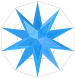
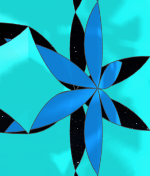
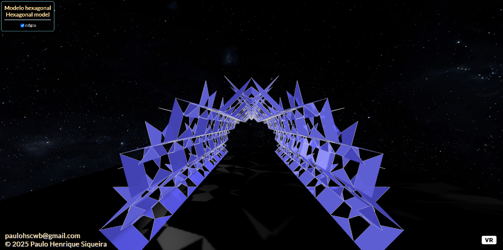

<link rel="stylesheet" href="../scripts/style.css">
<meta charset="utf-8">
<link rel="icon" type="image/png" href="../catalangems/vr/salas/imagens/icone.png">
<h2>Visualização com Realidade Virtual (RV) em A-frame</h2>
<b>autor:</b> Paulo Henrique Siqueira - Universidade Federal do Paraná
 <b>contato:</b> <a href="#"> paulohscwb@gmail.com </a>
 <a href="https://paulohscwb.github.io/kirigami/">english version</a>
  O Kirigami é uma arte tradicional japonesa que significa "recortar papel" (kiru - recortar, kami - papel). Trata-se de uma variação do origami, que combina a técnica de dobrar o papel com a arte de recortá-lo para criar figuras tridimensionais e efeitos interessantes de sombras. 
 O origami utiliza apenas dobras, enquanto o kirigami introduz cortes para dar volume e alguma complexidade às formas, podendo ser usado em decorações, cartões, maquetes e outros objetos. 
 Este trabalho mostra a arte do kirigami de uma forma um pouco diferente: as folhas são modeladas em arquivos para visualização em Realidade Virtual (RV).

<h3 style="margin-top:3px"><a target="_blank" href="../parte1/pt-br/"> Kirigamis poligonais</a></h3>
<!--<h3 style="margin-top:3px"><a target="_blank" href="../parte2/pt-br/"> Temas florais</a></h3>-->

<h3 align="center">Realidade Virtual</h3>

<h3 align="center">Modelos 3D</h3>

 Os scripts de órbita desenvolvidos por <b>Kevin Ngo</b> foram usados nas páginas de Realidade Virtual dos modelos 3D: <a href="https://github.com/supermedium/superframe/tree/master/components/orbit-controls/" target="_blank"> Orbit controls for A-Frame</a>.
 Os scripts de teleporte desenvolvidos por <b>Fernando Serrano</b> foram usados nas páginas de Realidade Virtual dos modelos 3D: <a  href="https://aframe.io/blog/teleport-component/" target="_blank"> Developing an A-Frame Teleport Component</a>
 

  Kirigami: visualization with Virtual Reality de <a xmlns:cc="http://creativecommons.org/ns#" href="https://paulohscwb.github.io/kirigami/" property="cc:attributionName" rel="cc:attributionURL">Paulo Henrique Siqueira</a> está licenciado com uma Licença <a rel="license" href="http://creativecommons.org/licenses/by-nc-nd/4.0/">Creative Commons Atribuição-NãoComercial-SemDerivações 4.0 Internacional</a>.

<h4>Como citar este trabalho:</h4> 

Siqueira, P.H., "Kirigami: Visualization with Virtual Reality". Disponível em: <https://paulohscwb.github.io/kirigami/>, Agosto de 2025.

<!---->
 <b>Referências:</b>
 Otsu, G. M., Yamada, T. R. U. Kirigami 3D aplicado: uma proposta em design de produto dobrável. Revista Brasileira de Expressão Gráfica, v. 7, n. 1, 2019 <a href="https://www.rbeg.net/index.php/rbeg/article/view/73" target="_blank">https://www.rbeg.net/index.php/rbeg/article/view/73</a>
 Khalilzadehtabrizi, S., Mohagheghian, I., Walker, M. G., Analysis and design of Kirigami-based metallic energy-dissipating systems, Thin-Walled Structures, v 212, 2025 <a href="https://doi.org/10.1016/j.tws.2025.113127" target="_blank">https://doi.org/10.1016/j.tws.2025.113127</a>
Yamada, T. R. U. Processo de Experimentação e criação de modelos autorais de Kirigami 3D baseados em técnicas de dobra e corte. In: Anais Graphica 2024: XV International Conference on Graphics Engineering for Arts and Design. Pelotas(RS), 2024. <a href="https://www.even3.com.br/anais/graphica-430628/826538-processo-de-experimentacao-e-criacao-de-modelos-autorais-de-kirigami-3d-baseados-em-tecnicas-de-dobra-e-corte/" target="_blank">https://www.even3.com.br/anais/graphica-430628/826538-processo-de-experimentacao-e-criacao-de-modelos-autorais-de-kirigami-3d-baseados-em-tecnicas-de-dobra-e-corte/</a>